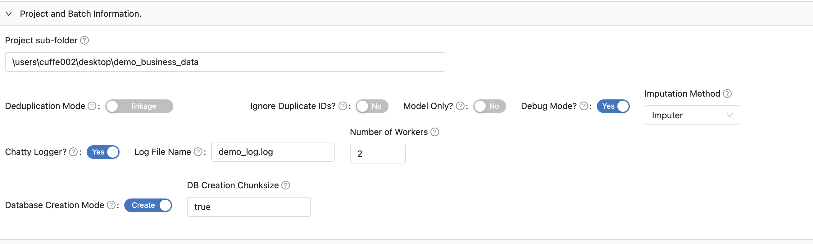
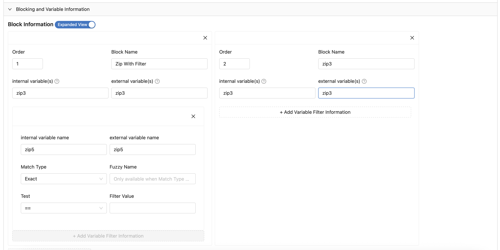
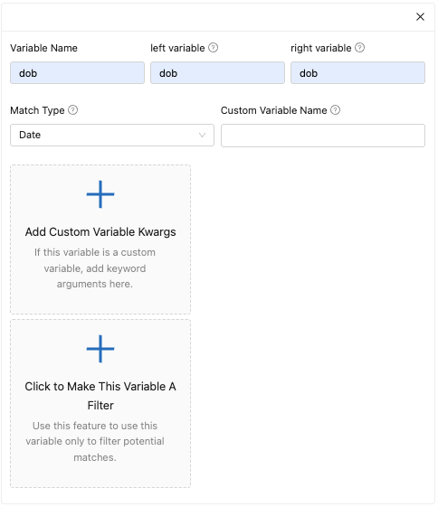

# MAMBA - Multiple Algorithm Matching for Better Analytics
# Table of Contents

[Introduction](#Introduction)

[Installation](#Installation)

[Configuration Guide](#ConfigurationGuide)

[Business Data Configuration Demo](#demo_business_data)

[R10000 Data Configuration Demo](#r_10000_demo)

# Introduction

MAMBA is an attempt to provide a flexible, scalable record linkage platform that avoids reliance on a single metric or modelling approach.  Initially developed to assist in linking business records, the current version of MAMBA can link _any_ kind of data with any Pythonic model, with the user have full power to customize any blocks, features, models, and filters for their purposes.
##  The important legal stuff
This prototype was developed as part of the Frames program at the U.S. Census Bureau. The views expressed are those of the authors and not necessarily those of the U.S. Census Bureau. The U.S. Census Bureau has reviewed this data product to ensure appropriate access, use, and disclosure avoidance protection of the confidential source data used to produce this product.

We appreciate any feedback you would like to provide us; please post any questions that you may have in the GitHub issues section

Contributing: see [here](https://github.com/uscensusbureau/MAMBA/Contributing.md)

## Getting started
 <a id="Getting-started"/></a>
 
System requirements:

Python 3.11

OPTIONAL BUT HIGHLY RECOMMENDED: Node.js > 20.0

Getting MAMBA:

Download from the GitHub repo, [here](https://github.com/uscensusbureau/MAMBA)

## What Does MAMBA do?

MAMBA is going to identify matching records from two (or a single datafile if running in deduplication mode). You then customize the data, variables, blocking, and models you want to use to match via the Guided User Interface (GUI), which is a controlled way for you to ensure your setup is correct. There are instructions below on what to do if, for some reason, you have no access to Node.js.

# Installation
 <a name="Installation"/></a>

## Python
1.  Once you have downloaded from our Git, you will need to install the Anaconda environment.
2.  Open a terminal and CD into the main MAMBA directory and type ```conda env create --file mamba_env.yaml```
3.  Once that is done, type ```conda activate mamba_env``` to activate the environment.
4.  Now we need to Cythonize our files.  Cythonizing is process that converts Python code into C-like compiled programs and makes them much faster.  It's basically witchcraft.  The important thing to know is 1) you must re-run this process anytime you make any alterations to the underlying code and 2) you can easily do this with the provided functions.
5.  CD into the programs directory and type ```python setup.py build_ext --inplace``` to run the file.
6.  If you are making changes,  you need to repeat this step whenever you make a change to files inside of /programs.
## GUI
In order to use the GUI, you MUST have node.js installed.  If your compute environment cannot host node.js, you can install this on another machine and then just copy the outputted file to your compute environment.
1.  Open a terminal and CD into the /gui directory.
2.  type ```npm install --legacy-peer-deps```
3.  This should install the GUI.


# Configuration Setup.
<a name=ConfigurationGuide></a>

This section will guide you through the configuration setup via the GUI.  IF you are unable to use the GUI, you can create your own configuration file using the legacy_configuration_name heading for each variable below.

IF YOU ARE NOT using the GUI, then you will need to create a mamba_properties.yml file mirroring what is found in the demo files (R10000 and test_business_data), but do so at your own risk. I include the 'legacy' definitions below so you can maybe trace what went wrong. But I strongly recommend using the GUI.

1.  CD into the gui directory in a terminal, then type ```npm start```.  
2.  Your internet browser should pop up with a screen that looks like the below.  If your browser does not automatically open, navigate to http://localhost:5173/mamba_gui.

3.  There are four basic controls for the application:
  - Accordion/Step slider. With this widget, you can control the accordian view (default) or step by step.  This demo will show the Accordion view, but the Step works the same way.
  - Save Form Configuration button: the button that saves the current configuration. When clicking this, the mamba_config.yaml will be saved to your DOWNLOADS (or wherever your browser's default download folder is) folder. YOu will then need to move the file to your projectPath (The directory where your data etc live.) Yes this annoying, but for very good security reasons browsers aren't given write access to file systems.
  - Reset Form: this button deletes all the data stored in the form.
  - Upload an existing configuration?: This button allows you to load an existing configuration to edit it.

### Configuration Setup:
1.  Create a folder outside of the main mamba directory called _demo_business_data_setup_.  This will be our _projectPath_ and host our various custom functions, models, logs, and our database.
#### Tab: Project and Batch Information
- Project sub-folder
  - legacy_configuration_name: projectPath
  - description: this is the full path to the folder that contains your data, database, configuration files, and any models or custom functions. In this example, it is the folder you created in step 1 above.
- Deduplication Mode:
  - legacy_configuration_name: mode (options: deduplication or matching)
  - description: when in deduplication mode, the system is trying to take a _single_ dataset and de-duplicating. Otherwise it is trying to link multiple datasets.
- Ignore Duplicate IDs:
  - legacy_configuration_name: ignore_duplicate_ids
  - description: Do you want MAMBA to ignore pairs where the 'id' varible matches?
- Model Only?:
  - legacy_configuration_name: model_only
  - description: When "True" the system only attempts to generate a model, but does not generate predictions based on that model.
- Imputation Method:
  - legacy_configuration_name: imputation_method
  - description: In cases of misses data, how do you want the data handled.  Imputer uses an Iterative Imputer (https://scikit-learn.org/stable/modules/generated/sklearn.impute.IterativeImputer.html) to provide estimates based on the other X values.  'Nominal' breaks down variables into roundable figures and creates a new category (e.g. -1) for missing values.  Default behavior is to skip.
  - Alternative options to imputation is to write your own custom functions.
- Chatty Logger?:
  - legacy_configuration_name: chatty_logger
  - description: When True, the logger will report outcomes for each block.
- Log File Name:
  - legacy_configuration_name: log_file_name
  - description: the name of the log file  you want to use.
- Number of Workers
  - legacy_configuration_name: numWorkers
  - description: The number of subprocesses to run. The larger the number of subprocesses, the faster (but more memory intensive) your processing.
- Database Creation Mode:
  - legacy_configuration_name: database_creation_mode
  - description: when selected, creates the database from scratch.  When not, database creation is skipped.  NOTE: creating a database when you have an existing one, the program will fail and you will either need to delete or move the existing database.  This is annoying but better than deleting your database by accident.
#### Tab: DB Information
This tab tells MAMBA about the database it will be interacting with.
- SQL Flavor
  - legacy_configuration_name: sql_flavor
  - description: What kind of SQL database are you connecting to? Options currently are SQLite and Postgres.

- DB Name
  - legacy_configuration_name: db_name
  - description: the name of the database.  In SQLite this is the .db file, in Postgres it's the database name.

The following options will _only_ appear when you select 'Postgres' as your database option.

- DB Host
 - legacy_configuration_name: db_host
 - description: the hostname of the postgres database.

- DB Schema
  - legacy_configuration_name: db_schema
  - description: the schema you want your database to automatically connect to.

- DB Username
  - legacy_configuration_name: db_user
  - description: the username used to log onto the database.

- DB Password Environment Var
  - legacy_configuration_name: Not Applicable
  - description: save your db password as an environment variable, and enter that variable name here.This way you won't accidentally commit your DB password.

- DB Port
  - legacy_configuration_name: db_port
  - description: the port number (for Postgres this is almost always 5432)

#### Tab: Data Sources
This tab is where we define the data names.

- Data 1
  - legacy_configuration_name: data1
  - description: the first dataset we want to match

- *Data 1* Custom Selection Statement
  - legacy_configuration_name: N/A.  This would be part of the 'custom_selection_statement' JSON for just the first data source.
  - description: a resolvable piece of SQL code to appear after a 'where' statement. for Example ```foo="bar"```

- Data 2
  - legacy_configuration_name: data1
  - description: the second dataset we want to match (disabled if Deduplication Mode is true)

- *Data 2* Custom Selection Statement
  - legacy_configuration_name: N/A.  This would be part of the 'custom_selection_statement' JSON for just the first data source.
  - description: a resolvable piece of SQL code to appear after a 'where' statement. for Example ```foo="bar"```

#### Tab: Blocking and Variable Information
This tab is where you enter in the blocks for your system to use and the variables you want to use to run your model.

##### Block information
A block is a discrete variable (could be a geographic area, or a zip code, or even the first character of a name) where you want _all_ records in your dataset to be compared to each other.  To add a blocking variable, first click on the 'Collapsed View' slider, and then click 'Add Blocking Level'

- Order
  - legacy_configuration_name: order
  - description: the order you want to run this block.

- Block Name
  - legacy_configuration_name: block_name
  - description: the name you want to give the block.

- *data1* variable(s)
  - legacy_configuration_name: *data1*
  - description: comma and space (e.g. ", ") separated column names that you want to make the block from your first dataset.

- *data2* variable(s)
  - legacy_configuration_name: *data2*
  - description: comma and space (e.g. ", ") separated column names that you want to make the block from your second dataset.

###### Add Variable Filter Information
One of the concept MAMBA uses is that of a "superblock", where the user can select large blocks (say, 3-digit zip codes) but add a restriction that the user can limit any comparisons to just those where the first 5 digits match.  See below for an explanation, but this sub-tab allows you to implement. Your larger block would remain as the block, and the sub-filter would be added here.
- *data1* variable_name
  - legacy_configuration_name: *data1*_variable_name
  - description: the variable for this sub-block from your first dataset.

- *data2* variable_name
  - legacy_configuration_name: *data1*_variable_name
  - description: the variable for this sub-block from your first dataset.

- Match Type:
  - legacy_configuration_name: match_type
  - description: What kind of match are you implementing with this filter?

- Fuzzy Name:
  - legacy_configuration_name: fuzzy_name
  - description: IF you have selected 'fuzzy' as your match type, what fuzzy comparator do you wish to use. Imput the __name__ of the febrl fuzzy comparator (e.g. jaro, winkler)

- Test:
  - legacy_configuration_name: test
  - description: What kind of test do you want to apply? Select from the options. 

- Filter Value
  - legacy_configuration_name: filter_value
  - description: What value, when applied to the test, do you want to use? For example, using a Test of ">" and a Filter Value of ".65" will mean you only keep records where the selected filter value is greater than .65

##### Notes about Blocks.

- All block variables are assumed to be strings or text data types.  Blocking by floats or integers is not supported.
- If you want to do a full cross product with no blocking, include a block called 'full' as the entry for the block name and 'full' as the columns for each datatype. 
  - If you select this option, then the program will automatically break up the full dataset into chunks of 10,000 records for each dataset. This is likely inefficient, but should gently encourage the user to find appropriate blocks.
- If you want to block on _multiple_ columns, ALL COLUMN HEADERS ACROSS BOTH DATASETS MUST BE THE SAME. 
  - If you want to use multiple columns, then you must do so on BOTH sets of data.
- You can reduce the ZipCode variable to any number of digits by including the digit at the end of ZipCode. For example, to block by 3-digit zip code, include a block that has 'ZipCode3' as its name.


#### Tab: Variable Types
In MAMBA, a variable is a feature that is used inside your model to predict if records match.  You generate these features by generating some comparison between the two records. Currently, MAMBA supports the following types of comparison:
- fuzzy: generate 12 fuzzy string comparators for the candidate pair
- num_distance: difference between the two values.
- exact: If the two values are equal (incluing missing), scored as a 1, otherwise scored as a 0.
- soundex: A Levenshtein distance comparison of soundex codes from the fuzzy library (see: https://pypi.org/project/Fuzzy/).
- nysiis: A Levenshtein distance comparison of NYSIIS codes from the fuzzy library (see: https://pypi.org/project/Fuzzy/).
- geo_distance: Distance between two points (in kilometers) based on Haversine formula. Using this type requires that each dataset has a ```latitude``` and ```longitude``` variable, and this column is completely filled for all observations.
- date: This type of date variable will be compared using the Levenstein (edit) distance between the two strings of dates.  Ensure your dates are formatted in the same way before saving your datasets.
    - If either value is missing, returns 0. 
    - We just use the edit distance here because it provides an informative view of the number of edits and substitutions required to make the strings match. This is preferred over a strict subtraction of dates. For example, 1/1/2021 and 1/1/1011 is most likely a clerical error and requires only one substitution would match, but a simple distance calculation would give these two dates as a millennia apart. If you want to select dates in a different way, you can build a custom function to do so.
    - If you wish to block or filter by particular portions of a date, then include it as a separate variable (so extract the year and put in a separate column).  This is because of issues with how pandas and python read potential erroneous timestamps [Pandas Docs](http://pandas-docs.github.io/pandas-docs-travis/user_guide/timeseries.html#timeseries-timestamp-limits)
- custom: this type of variable relies on a custom function saved in {your_project_path}/custom_scoring_methods.py

#### Variable type fields
- Variable Name:
  - legacy_configuration_name: variable_name
  - description: The name you want this variable/comparison to be referred to during the modelling and processing.
 
- *data1* variable
  - legacy_configuration_name: *data1*
  - description: the column in your first dataset used to calculate this variable.

- *data2* variable
  - legacy_configuration_name: *data2*
  - description: the column in your second dataset used to calculate this variable.

- Match Type
  - legacy_configuration_name: match_type
  - description: The type of match (options listed above) that this variable uses.

- Custom Variable Name
  - legacy_configuration_name: custom_variable_name
  - description: ONLY used if Match Type = Custom.  If that is the case, give the name of the function (Accessed via function.__name__ in Python) that lives inside of custom_scoring_functions.py

- Add Custom Variable kwargs
  - legacy_configuration_name: custom_variable_kwargs
  - description: if you have arguments to add to the custom variable, this is where you do them.  ONLY keyword (not positional) arguments are supported.
    - Keyword Argument Name
      - the name of the keyword argument.
    - Keyword Argument value
      - the value of the keyword argument.
- Click to Make This Variable a Filter
  - Use this button to use the variable as a global filter limiting all matches.  See above for descriptions.
    - Filter test: what test do you want to apply to the filter?
    - Value: what value do you want to test?
  
##### NOTE ON CUSTOM SCORING METHODS:

 - There is a _DEMO_ file provided, but you need to create your own in your projectPath directory.  
 - You MUST enter a 'custom_scoring_methods.py' file in the *projectPATH* directory.
 - The function must accept as an argument a tuple of size two _and also must handle missing values_ (e.g. by giving a particular value to missings).  The main system will break if you leave missings in there.
 - \*data1_name\* and \*data2_name\* can be referred to as X[0] and X[1] in the tuple (since remember, kids, Python counts from 0).
 - You MUST include an argument called 'headers' in your function, but leave it blank -- ```headers=''``` will suffice to default.  This ensures interoperability with the custom score generation and the other functions.


#### Tab: Model Outputs
This section covers the potential outputs from the process.

##### Predictions
This row describes outputs related to predicted matches from the process.

- Generate
  - legacy_configuration_name: prediction
  - description: do you want the process to use the model to generate predicted matches?
- Match Threshold
  - legacy_configuration_name: match_threshold
  - description: what is the value that you want to count as a 'match' for the model?
- Scoring Criteria
  - legacy_configuration_name: scoring_criteria
  - description: The Scikit Learn scoring criteria (https://scikit-learn.org/stable/modules/model_evaluation.html#string-name-scorers) selected for the model.  Note, some of the metrics may not work for all of your selected models.  The user will need to determine the _best_ criteria for their particular circumstance.
- Matched Pairs Table Name
  - legacy_configuration_name: matched_pairs_table_name 
  - description: What is the table name you want to use to store your matched pairs?

##### Clerical Review Candidates
MAMBA allows the user to generate clerical review candidates for potential matches to quickly generate training data.  This can be extremely valuable, as it also ensures the training data at least resembles the test data.  You can then iteratively develop more training data with different criteria to build your best model.
- Generate
  - legacy_configuration_name: clerical_review_candidates
  - description: Do you want to generate clerical review candidates?
- Clerical Review Candidates Table Name
  - legacy_configuration_name: clerical_review_candidates_table_name
  - description: What is the name of the database table you want to save your clerical review candidates to?
- Clerical Review Thresholds
  - legacy_configuration_name: clerical_review_thresholds
  - description: For each threshold that you want to count as a possible match, enter the information here for the variable and the value you want.
- Query Logic
  - If you have _multiple_ clerical review thresholds, do you want these to be selected via an AND statement (e.g. foo=='bar' and var > 2) or an OR statement (e.g foo=='bar' or var > 2)

##### Notes on Clerical Review Candidates
- If you are using a fuzzy value, use the variable as a combination of "{variable_name}_{fuzzy_name", so for example "name_jaro" or "address_qgram3"

#### Tab: The Model
This tab gives MAMBA the instructions on the statistical model you will be using to generate your linkage.

- Use Built-In MAMBA Models?
  - legacy_configuration_name: use_mamba_models
  - description: Do you want the program to use the built-in modelling options from MAMBA.
- Use Custom Model:
  - legacy_configuration_name: use_custom_model
  - description: Do you want to run a custom model that you have built. Can be used to test against, or in place of, the MAMBA models.
- Use Saved Model
  - legacy_configuration_name: saved_model
  - description: If you ARE NOT using MAMBA models, this is where you enter the filename of your model (include the .joblib ending). See below for notes on custom models.
- Fit an AdaBoost Model?
  - legacy_configuration_name: use_ada
  - description: Do you want to have MAMBA attempt to fit an Ada-boosted Decision Tree algorithm?
- Fit a Random Forest Model?
  - legacy_configuration_name: use_rf
  - description: Do you want MAMBA to fit a Random Forest model?
- Fit a Logistic Regression?:
  - legacy_configuration_name: use_logit
  - description: Do you want MAMBA to fit a Logistic Regression?
- Feature Elimination Mode:
  - legacy_configuration_name: feature_elimination_mode
  - description: If True, MAMBA will iteratively eliminate features in the model until it sees a drop in scoring performance.  This mode is especially useful for eliminating extra fuzzy features that do not provide input to the model but increase calculation time.
- Training Data File:
  - legacy_configuration_name: training_data
  - description: The name of the file (usually training_data.csv) that contains the IDs and indicator on if the pair is a match.
- Saved Model Name?
  - legacy_configuration_name: saved_model_target
  - description: The name you want to give if you are saving your model.
##### Notes on Model Selection
###### Custom Models
  - Users may wish to user their own custom matching model in addition to those available in MAMBA, or with different default values. There are two ways to do this:
  - Fit the custom model
    - To do this, the model must be a fully self-contained Python function that accepts the following arguments:
      - y: an array of 1/0 match/no match values for the training data.  These will be automatically generated by MAMBA, but your class needs to accept the argument.
      - X: an array of right-hand-side variables for the training data.  These will be automatically generated by MAMBA, but your class needs to accept the argument.
      - X_hdrs: an array of the heads of the X array above.
    - The function must return a dictionary with the following options:
      - type: use 'custom' for this
      - score: The score on the metric you are using to determine the 'best model'
      - model: the actual model itself
      - variable_headers: X_hdrs (yes, this is repetitive, but gives us flexibility if we ever wanted to change the way the headers are generated and used.)
  - Use a previously-fitted custom model
    - If you already have a model (e.g. a deterministic model that doesn't require fitting) you can use MAMBAs built-in features to apply it without having to fit the alternatives.  In this scenario you just turn off the MAMBA models and Custom model toggles and enter in the name of the .joblib file associated with your model.
    - How do you do that?
      - In the custom_model.py file within your projectPath folder, create a _class_ with the name of your model. Below shows a basic 'class' for the deterministic model used in the R10000 deterministic model 
      ```
      def score_func(vals):
        '''This will be applied to each column, just looping through the values calculating the rounded scores.'''
        return [1 if v > .9 else 0 for v in vals]
      class deterministic_model:
         '''Define our inits'''
         def __init__(self):
            self.X: None
            self.y: None

        def predict_proba(X):
          '''This is the score generating function
          :param X: a matrix of scores.  Columns are 1) first_name, 2) last_name, 3) dob.  Logic is if the value presented is above .9, we give the value a 1, otherwise we give it a 0, then sum.
          Yes that isn't how record linkage actually works.
          :return: Array of scores with each row having its own _list_ of values.'''
          return [[np.sum(i)] for i in np.apply_along_axis(score_func, 0, X)]
      ```
      - Once you've done that, cd into the main MAMBA terminal.
      - Next, gather a list of the headers used in your model.  Put them in the order they appear in your variables section in the configuration, separated by a comma.
      - Now run the pickle_model.py file with your specified project path
      ```python programs/pickle_model.py -projectPath YOUR_PROJECTPATH -headers YOURHEADERSLIST -saved_file_name THENAMEOFTHEJOBLIBFILETOSAVETO -model_name NAMEOFTHEMODEL```
        - See the R10000 deterministic walkthrough below for a demo.


#### Tab: Debug Blocks
You will have problems running MAMBA.  That's inevitble.  But this feature allows you to run the entire program with just a couple of blocks so you can familiarize yourself with the process and experiment with different settings.

- Block Order
  - legacy_configuration_name: block_order (inside of debug_block json)
  - description: What is the block order (see the block tab above) that this debug block refers to?
- Variable Name
  - legacy_configuration_name: variable_name (inside of debug_block json)
  - description: what is the variable name for the debug block?
- Value
  - legacy_configuration_name: value (inside of debug_block json)
  - description: what is the value that indicates that this is the correct block?


# Configuration Demo: demo_business_data
<a name=demo_business_data></a>

I know, that seems confusing.  So The next two sections are going to run you through the process of creating, editing, and running MAMBA configurations via the GUI.

1. Open a terminal (Anaconda prompt or Terminal in Mac/Linux)
2. CD into the MAMBA/gui directory.
3. Type ```npm start```
4. If it doesn't happen automatically, open an internet browser and navigate to http://localhost:5173/mamba_gui.  You should see a screen like this:

5. This tutorial will use the 'Accordian' method, but you can use the stages interchangeably.
6. The demo_business_data is an impossibly small test dataset, but is suitable for our purposes of showing you how all of the features of MAMBA work.
7. Create a folder in a location other than your MAMBA directory called 'demo_business_test'. I'm putting mine in my desktop.
8. In the Project and Batch Information tab:
   1. Have your Project Sub-folder be the directory you created above.
   2. Deduplication Mode should be set to Linkage.
   3. Keep Ignore Duplicate IDs as No.
   4. Debug Mode to Yes.
   5. Use the 'No Imputation' imputation method.
   6. Turn Chatty Logger on and give the log file name as 'demo_log.log'
   7. Assign 2 workers.
   8. Turn Database Creation Mode to 'Create'
   9. Keep the default DB Creation Chunksize (the parameter will only appear after moving the Database Creation Mode to 'Create')
9. Your screen should look like this:

10. For our database information, we will use SQLite and call the database name 'sqlite_db.db'.

11. Our two data sources are called 'internal' and 'external'. As a reminder, no data here are in anyway subject to Titles 13, 26, or any other federal privacy laws.  They are randomly generated by datagenerator.com.
12. For the external data, we want to exclude all businesses in Texas (there shouldn't be a match here).  So enter ```StateName != 'TX' ``` as the external Custom Selection Statement.
    1. You have to use _single_ quotes for this step: double quotes in SQL have a very specific usage (it identifies DB objects or columns).
    2. If you want to use something with quotes (e.g. you want to limit yourself to weapon_type=bat'leth, use double dollar signs -- so weapon_type=$$bat'leth$$)

13. Now let's build some blocks and variables. Put the block information into Expanded View and add two blocks.
    1. 3 Digit Zip (with filter) - this block will be on the 3-digit zip code level, but only compare cases where the 5 digit zip code matches.  You want to do this to help optimize the overall size of our blocks -- when comparing large datasets, having thousands of small blocks can be less efficient than smaller number of larger blocks.  
       1. Order: 1
       2. Block Name: Zip with Filter
       3. internal variable: zip3
       4. external variable: zip3
       5. variable filter information:
          1. internal variable name: zip5
          2. external variable name: zip5
          3. Match Type: exact
          4. Fuzzy Name: leave blank
          5. Test: =
          6. Filter Value: leave blank
    2. 3 Digit Zip (no filter)
       1. Order: 2
       2. Block Name: zip3
       3. internal variable: zip3
       4. external variable: zip3
14. After the blocks you should be able to see this:
    
15. Now our variables.  We will have several variables in this model just to show you the different capabilities of the system.
    1. Name: comparing the names of the candidate pairs
       1. Variable Name: name
       2. internal variable: name
       3. external variable: name
       4. Match Type: fuzzy
       
       
    2. Address: comparing the addresses of the candidate pairs
       1. Variable Name: address
       2. internal variable: street_address
       3. external variable: address
       4. Match Type: exact
       
       
    3. AddressNumber: this is a quick test of a custom function for address number.  The actual function doesn't make any sense.
       1. Variable Name: address_number
       2. internal variable: AddressNumber
       3. external variable: AddressNumber
       4. Match Type: custom
       5. Custom Variable Name: address_comp
       6. Custom Variable Kwargs:
          1. Keyword Argument Name: comp_type
          2. Keyword Argument Value: comparison
       
       
    4. geo_distance: how far apart are the records? Note here that we just fill in 'geo' but those columns don't exist, under the hood MAMBA pulls the latitude and longitude variables
       1. Variable Name: geo_distance
       2. internal variable: LEAVE BLANK
       3. external variable: LEAVE BLANK
       4. Match Type: Geographic Distance
       
       
    5. founding_date: this variable compares the founding dates of the candidate pair
       1. Variable Name: founding_date
       2. internal variable: date_founded
       3. external variable: founding_date
       4. Match Type: date

       
    6. fuzzy_filter: finally, we will add a fuzzy filter where the name_qgram3 of any match must be above .3 in order to be considered for a match.
       1. Variable Name: fuzzy_filter
       2. internal variable: name
       3. external variable: name
       4. Match Type: fuzzy
       5. Filter Information (click on 'Click to make this variable a filter' button)
          6. Filter Test: "Greater Than"
          7. Filter Value: .1
          8. Fuzzy Name: qgram3
          
       
16. When you're done with your variables and blocks, turn off the exapanded view, you should see something like this:

17. No let's fix our Model.  
    1. Predictions:
       1. Generate? Yes
       2. Match Threshold: .5
       3. Scoring Criteria: f1
       4. Matched Pairs Table Name: matched_pairs
    2. Clerical Review Candidates
       1. Generate? Yes
       2. Clerical Review Candidates Table Name: clerical_review_candidates
       3. Clerical Review Threshold:
          1. Variable Name: name_qgram3
          2. Value: .4
       4. Query Logic: Leave Blank
          

18. Now Let's build our Model.  
19. Turn on 'Use Built-In MAMBA Models'
20. Then select to fit an AdaBoost model and a Random Forest model, with Random Forest Jobs being 1.
21. The training data file is 'training_data.csv'
22. Saved Model Name will be 'full_model.joblib'
23. For the Fuzzy Variables used, select Edit (Lev.) Distance, Jaro-Winkler, Longest Common Substring (3), Qgram (3, Trigram), and Smith-Waterman distance.  There is no particular logic here, this is just to show you how you would select different fuzzy variable types.

24. Finally, let's do a debug blocks of 829

25. Now hit 'Save Form Configuration'.  In your Downloads (or wherever your browser is set to download), you should now see a file called 'mamba_config.yaml'.  Move this file into your project directory (so where you filled in for Project sub-folder)
26. Copy the contents of the demo_business_data folder to the same directory.
27. Now lets run MAMBA.
28. Activate the MAMBA anaconda environment.
29. Create an environment variable called 'projectPath', which is the directory you saved those files in.  In a unix-like system, this is ```export projectPath=YOUR/PATH/GOES/HERE```.  On Windoes Powershell you use the :env command.
30. cd into the main mamba directory.
31. type ```python run_match.py```
You should see something like this

32. Ok.  Now let's run the full model.  Go back into the GUI and remove the debug block, then change Use Saved Model? to read 'full_model.joblib'. Download the updated file and then save it into your project directory.  Make sure to delete your old configuration from your project path.
33. Once you've done that, got back to your terminal and type ```python run_match.py``` once again.
34. Congratulations! You have run MAMBA!

# Configuration Demo: R10000 Person Data with Deterministic Model
<a name=r_10000_demo></a>

This dataset is a standard R dataset used to deduplicate names.  So we will run this process in Deduplication mode.We will also build a 'custom' deterministic model instead of using MAMBA's pre-built defaults.
1. First, copy the contents of the R10000 data into a folder outside of your mamba directory.
2. Next, in a terminal, CD into the main MAMBA directory.
3. Type ```python programs/pickel_model.py -projectPath path/to/the/file/you/just/created -headers first_name_winker,last_name_winkler,dob -saved_file_name deterministic_model -model_name deterministic_model```
   - NOTE that the variable headers for the fuzzy variables have the _winkler ending.
4. You should see a 'success' message.
5. Now, let's set up our configuration. We will run this one in 'Step' mode for a little treat for ourselves.
   1. Enter the projectPath from your argument above
   2. Dedpulication Mode: Yes
   3. Ignore Duplicate IDs: Yes
   4. Model Only? No
   5. Debug Mode? Yes
   6. Imputation Method: No Imputation
   7. Chatty Logger: Yes
   8. Log File Name: deterministic_logger
   9. Number of Workers: 2
   10. Database Creation Mode: Create
   11. DB Creation Chunksize: 100000
6. Now that you have entered deduplication mode, you will notice for the below that instead of variable names you'll see 'left' and 'right'.  That is because, under the hood, and to re-use as much code as possible, we arbitrarily assign left and right to the sides of the comparison we are making.  

7. For the DB Information section:
   1. SQL Flavor: SQLite
   2. DB Name: sqlite_db

8. Block information.  Here we have a single block, the first letter of the first name (this is created in the database already). One of the things to remember for deduplication mode is that you need to have the names of the two variables be the same (since really we are hitting the same table.)
   1. Order: 1
   2. Block Name: Block
   3. left variable(s): block
   4. right variables(s): block

9. Variable Information: Our _very_ simple (and inaccurate, don't @ me) deterministic model has three variables: the winkler score of the first name, the winkler score of the last name, and then a date comparison of the date of birth. One of the things to remember for deduplication mode is that you need to have the names of the two variables be the same (since really we are hitting the same table.)
   1. Variable: first_name
      1. left variable: first_name
      2. right variable: first_name
      3. Match Type: fuzzy
   
   2. Variable: last_name
      1. left variable: last_name
      2. right variable: last_name
      3. Match Type: fuzzy
      
   3. Variable: dob
      1. left variable: dobd
      2. right variable: dob
      3. Match Type: date
      
10. Model Outputs.  Here, we don't want to use clerical review candidates.
     1. Predictions Row
        1. Generate?: Yes
        2. Match Threshold: 1.95
        3. Scoring Criteria: LEAVE BLANK
        4. Matched Pairs Table Name: matched_pairs
     2. Clerical Review Candidates Row:
        1. Generate? No.
     
11. The Model
    1. Use Built-in MAMBA models? No
    2. Fit a Custom Model? Yes
    3. Custom Model Name: deterministic_model
    4. Fuzzy Variables Used: Jaro-Winkler
     
12.  Now save and download your configuration into  your projectPath
13. Now CD into the main MAMBA directory.
14. Set your projectPath as an environment variable (on a unix-like terminal, ```export projectPath=path/to/your/project```)
15. type ```python run_match.py```
